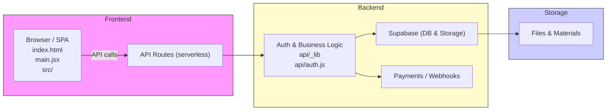

# Spectrum — Ferramenta de Adaptação e Automação

Este repositório reúne uma solução dupla: uma camada de automação responsável por processar dados e integrar serviços em fluxos automatizados, e uma aplicação leve que serve como interface de desenvolvimento e protótipo navegável.

Sumário
- Visão geral
- Solução de automação
- Solução de desenvolvimento
- Diagrama do ecossistema (Mermaid)
- Memorial de construção
- Navegação rápida pelo repositório

**Visão geral**

O projeto tem dois focos complementares:

- Solução de automação: componentes no diretório `api/` que processam dados, geram URLs assinadas, integram com serviços externos (Supabase, provedores de pagamento, etc.) e automatizam fluxos de trabalho relacionados ao manejo de arquivos, usuários e pagamentos.
- Solução de desenvolvimento: uma aplicação frontend leve (arquivos em `src/`, `index.html`, `main.jsx`) que fornece uma interface navegável, protótipos de componentes e páginas para interação, visualização e testes de usabilidade.

Principais funcionalidades

- Geração de URLs assinadas para upload/download de arquivos
- Endpoints para gerenciamento de usuários e instituições
- Integração com Supabase (cliente e Admin)
- UI responsiva com componentes reutilizáveis em `src/components`

Diagrama do ecossistema


```

Memorial de construção

- Problema abordado: adaptar materiais educacionais para crianças neurodivergentes, automatizando conversões, armazenamento e distribuição; além de prover uma interface simples para editores e avaliadores.
- Público-alvo: instrucionais e equipes educacionais que precisam de um fluxo de trabalho para preparar, adaptar e distribuir conteúdo.
- Ferramentas escolhidas:
	- Frontend: React + Vite (arquivos principais: `index.html`, `main.jsx`, `src/`)
	- Backend: rotas serverless em `api/` integradas ao Supabase (DB e Storage)
	- Integrações: Supabase (cliente e admin), provedores de pagamento (webhooks em `api/payments/`)
	- Infra/Deploy: `vercel.json` (configurações de deploy)
- Papel da IA: utilizada para auxiliar no processamento de conteúdo (ex.: sumarização, adaptação, sugestões de linguagem), automatizar transformação de material e acelerar criação de prompts. A IA também pode ter sido usada para gerar rascunhos de componentes e estratégias de teste.
- Prompts e estratégias: mantenha um repositório separado ou `docs/prompts.md` (sugerido) com templates de prompts, exemplos de entrada/saída e controle de versões dos prompts usados em produção.
- Limitações conhecidas:
	- Maturidade limitada das rotas (revisar autenticação, validações e tratamento de erros em produção)
	- Gestão de custos e segurança para integração com IA externa precisa ser avaliada
	- Testes automatizados faltantes para várias rotas de integração
- Melhorias futuras:
	- Testes end-to-end para fluxos críticos
	- Observability (logs estruturados, métricas)
	- Painel administrativo para revisões manuais e métricas de uso

Navegação rápida pelo repositório

- Ponto de entrada frontend: `index.html`, `main.jsx`
- Shell / Páginas: `src/pages/App.jsx`, `src/pages/AppShell.jsx`, `src/pages/LoginPage.jsx`
- Componentes UI: `src/components/` e `src/components/ui/`
- Endpoints e automações: pasta `api/` (ex.: `api/files/signed-url.js`, `api/payments/webhook.js`)
- Configurações e infra: `vercel.json`, `vite.config.js`, `package.json`

Como rodar localmente (resumo rápido)

1. Instale dependências e ajuste o arquivo .env:

````bash
VITE_SUPABASE_URL=
VITE_SUPABASE_ANON_KEY=
VITE_COHERE_API_KEY=
VITE_COHERE_MODEL=
SUPABASE_SERVICE_ROLE_KEY=
SUPABASE_URL=
````
```bash
npm install
```

2. Execute o servidor de desenvolvimento (Vite):

```bash
npm run dev
```

3. Para executar rotas serverless localmente, use a plataforma de deploy local (ex.: Vercel CLI) ou adapte rotas para um servidor Node de desenvolvimento.

Contribuições

Sinta-se à vontade para abrir issues descrevendo problemas, melhorias ou tarefas.


